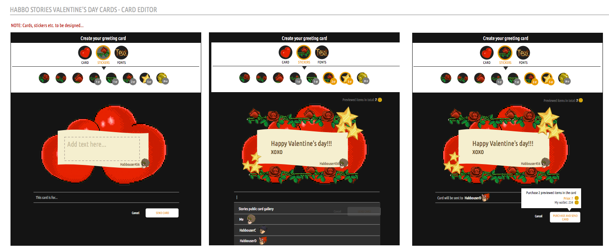
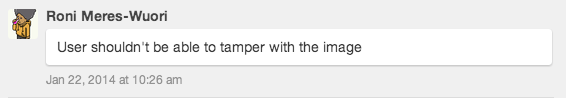
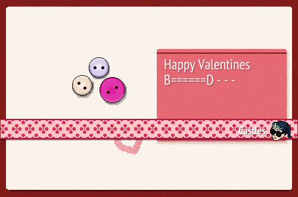
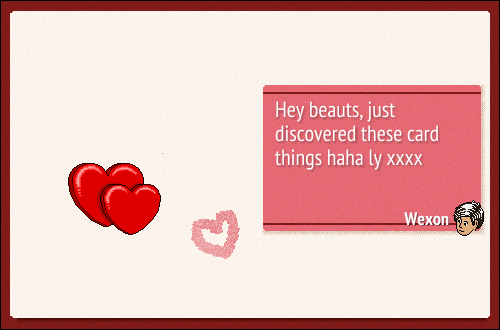
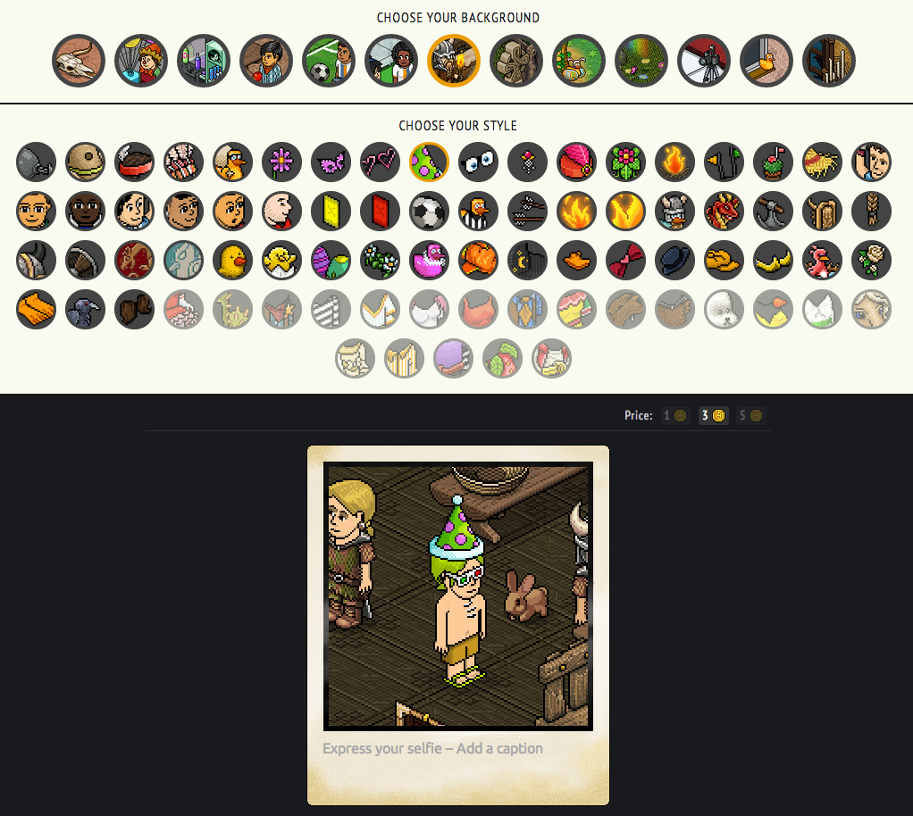
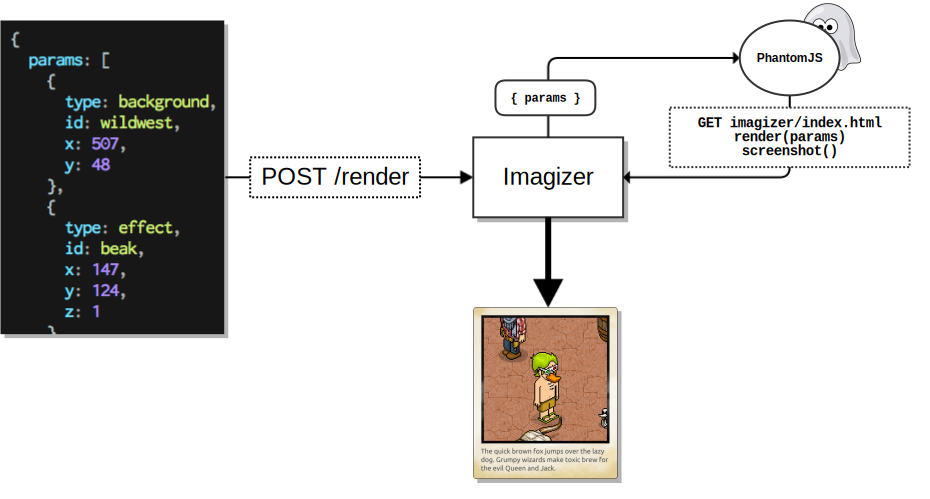
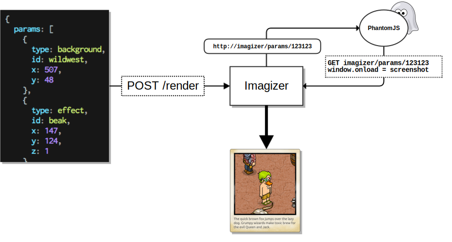

class: middle

- selfie editor background
- how imagizer works
- brief intro to react and flux

---

class: middle, center

# Postcard

---

# Postcard

.fit-img[
  
]
early mock-up

---

# Postcard

--

- needs to work together with angular in stories frontend

--



--

- use same code for the editor UI and rendering

--

  → render on the server-side with a headless browser


---

## Proof of concept for Postcard

- phantomjs + canvas + `toDataURL()`

--

.left[
```bash
curl -H "Content-type: application/json" \
     -d '{"texts": ["hello world", "such comic sans"]}' \
     http://postcard-poc.herokuapp.com/postcard
```

]

.float-right[]

--

### conclusions

--

- canvas is difficult to manipulate without heavy libs

--

- DOM is easy to manipulate and facilitates drag & drop well

--

- jQuery already exists in stories (no extra deps)

--

- phantomjs screenshots are transparent in areas that have nothing

---

# Valentine's Postcard

- phantomjs + `render(params)` → DOM + `screenshot('postcard.png')`

.smaller-imgs[
  
  
]

---

# Params

--

- instructions for both editor UI and server-side renderer

```
{
  "params": [
    {
      "type": "background",
      "id": "catwalk",
      "x": 753,
      "y": 718
    },
    {
      "type": "avatar",
      "src": "https://habbo.com/habbo-imaging/avatar/hr-893-35.hd-180-14.ch-3030-1408.lg-270-64.sh-300-64.ea-1403-1408.cc-260-73,s-0.g-1.d-2.h-2.a-0,b5e0ae6d863e076c027a7c8e95e37db4.png"
    },
    {
      "type": "message",
      "text": "Germany Fifa World Cup 2014 Champion!!!!"
    },
    {
      "type": "effect",
      "id": "neymar",
      "x": 0,
      "y": 0,
      "z": 1
    }
  ]
}
```

---

layout: true

# Selfie Editor

.float-right.fit-img[
  
]

---

 

---

.absolute[
```
[
  { 
    type: 'effect',
    id: 'carnivalhat'
  }
]
```
]

---

.absolute[
```
[
  { 
    type: 'effect',
    id: 'carnivalhat',
    x: 20,
    y: 47,
    z: 1
  }
]
```
]

---

.absolute[
```
[
  { 
    type: 'message',
    text: 'nigga this shit'
  }
]
```
]

---

.absolute[
```javascript
if (data.error.code === 'MODERATED') {
  findParam('message').text = data.error.message;
}
```
]

---

.absolute[
```
[
  { 
    type: 'message',
    text: 'bobba this bobba'
  }
]
```
]

---

layout: false

## habbo-stories-imagizer

.fit-img[
  
]

- phantomjs renders the selfie from params
  - takes a screenshot after all assets have loaded

---

## habbo-stories-imagizer

.fit-img[
  
]

**soon in master**
- node renders params to static markup
- phantomjs simply waits for a page to load and takes a screenshot

---

class: middle, center

# React


???

- editor rewritten in react

---

layout: true

# React

---
 

---

- lib for building user interfaces

--

- components: `Greeter({ name: 'Masa' })`

???

- apps are composed of components
- components describe the UI in any point in time

--

```javascript
var Greeter = React.createClass({
  render: function() {
    return <span>Terve {this.props.name}</span>;
  }
});

React.renderComponent(<Greeter name="Masa" />, mountNode);
```

--

Terve Masa

---

- no templating system

--

- JSX for markup (optional)

--

```javascript
var TodoList = React.createClass({
  render: function() {
    var list = this.props.items.map(function(item) {
      return <li>{item}</li>;
    });

    return <ul>{list}</ul>;
  }
});

React.renderComponent(<TodoList items={items} />, mountNode);
```

---

- no templating system

- JSX for markup (optional)

```javascript
var TodoList = React.createClass({
  render: function() {
    var list = this.props.items.map(function(item) {
      return React.DOM.li(null, item);
    });

    return React.DOM.ul(null, list);
  }
});

React.renderComponent(TodoList({ items: items }), mountNode);
```

---

- __key__: re-render the whole app when data changes

--

- everything is declarative

--

- `render` method states what a component should look at any point of time

--

- virtual DOM

---

layout: true

## More examples

---

.left-pre[
```
/** @jsx React.DOM */
var Time = React.createClass({
  render: function() {
    return (
      <span>
        {this.props.date.toLocaleTimeString()}
      </span>
    );
  }
});

React.renderComponent(
  <Time date={new Date()} />,
  mountNode
);
```
]

<div class='float-right' id='time'></div>

???

- component that prints the given date as an understandable string
- refreshing the page prints the current time

---

.left-pre[
```
/** @jsx React.DOM */
var Clock = React.createClass({
  getInitialState: function() {
    return { date: new Date() };
  },
  componentDidMount: function() {
    this.interval = setInterval(this.tick, 1000);
  },
  componentWillUnmount: function() {
    clearInterval(this.interval);
  },
  tick: function() {
    this.setState({
      date: new Date()
    });
  },
  render: function() {
    return <Time date={this.state.date} />
  }
});

React.renderComponent(
  <Clock />,
  mountNode
);
```
]

<div class='float-right' id='clock'></div>

---

.left-pre[
```
/** @jsx React.DOM */
var AnotherClock = React.createClass({
  getInitialState: function() {
    return { date: new Date() };
  },
  componentDidMount: function() {
    this.start();
  },
  start: function() {
    var self = this;
    (function tick() {
      self.setState({ date: new Date() });
      requestAnimationFrame(tick);
    }());
  },
  render: function() {
    return (
      <FormattedTime
        date={this.state.date}
        format={'ISOString'}
      />
    );
  }
});
```
]

<div class='float-right' id='another-clock'></div>

---

.left-pre[
```
/** @jsx React.DOM */
var AnalogClock = React.createClass({
  getInitialState: function() {
    return { date: new Date() };
  },
  componentDidMount: function() {
    this.start();
  },
  start: function() {
    var self = this;
    (function tick() {
      self.setState({ date: new Date() });
      requestAnimationFrame(tick);
    }());
  },
  render: function() {
    return (
      <ClockFace date={this.state.date} />
    );
  }
});
```

]

<div class='float-right analog-clock'></div>

???

- css clock stolen from momentjs site

---

.left-pre.smaller-pre-text[
```
/** @jsx React.DOM */
var ClockFace = React.createClass({
  render: function() {
    var d = this.props.date;
    var millis = d.getMilliseconds();
    var second = d.getSeconds() * 6 + millis * (6 / 1000);
    var minute = d.getMinutes() * 6 + second / 60;
    var hour = ((d.getHours() % 12) / 12) * 360 + 90 + minute / 12;

    return (
      <div className="circle">
        <div className="face">
          <div className="second" style={transform(rotate(second))} />
          <div className="hour" style={transform(rotate(hour))} />
          <div className="minute" style={transform(rotate(minute))} />
        </div>
      </div>
    );
  }
});

function transform(str) {
  return { transform: str };
}

function rotate(deg) {
  return 'rotate(' + deg + 'deg)';
}
```
]

<div class='float-right analog-clock' style='position: absolute; top:20%; right:0'></div>

---

layout: false

---

class: middle, center

# Flux

???

- an application architecture for unidirectional data flow
- data and changes to it flow in single direction

---

class: middle, center

.fit-img[
  
]

???

- editor uses reflux

--

### Reflux
github.com/spoike/refluxjs

---

class: middle, center

.fit-img[
  
]

???

- dispatcher manages dependencies between stores

--

### Flux
github.com/facebook/flux


---

# Links

- [Removing User Interface Complexity, or Why React is Awesome](http://jlongster.com/Removing-User-Interface-Complexity,-or-Why-React-is-Awesome) jlongster.com
- [Pete Hunt: React - Rethinking Best Practices](https://www.youtube.com/watch?v=DgVS-zXgMTk) youtube.com
- [Hacker Way: Rethinking Web App Development at Facebook](https://www.youtube.com/watch?v=nYkdrAPrdcw#t=622) youtube.com

 
- [clock](http://jsfiddle.net/rainev/6sdzchsd) jsfiddle.net
- [react doge clock](http://jsfiddle.net/rainev/vx4r5qzv) jsfiddle.net
- [Selfie Editor dev sandbox](http://habbo-stories-imagizer-dev.herokuapp.com/test.html) herokuapp.com


- [the tool used for the slides](http://remarkjs.com/) remarkjs.com
- repo https://github.com/raine/editor-react-aug2014.git
